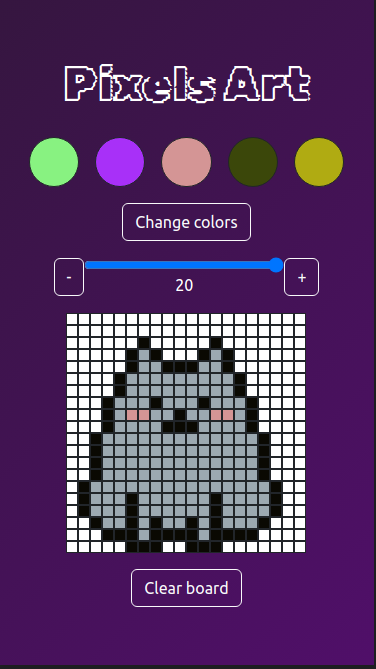

# 🎨🖌 Pixels Art

## 🇺🇸 About this project

This project was one of the first ones I developed as a Web Development student.

Its proposal was to develop a simple art editor, in which the user is able to choose a color from a palette and paint the white squares.

The user is also able to randomize the color palette and clear the board by clicking the selected buttons.

## 📝 Installation
1. Clone the repository `git@github.com:biancashiromoto/03-project-pixels-art.git`
2. Install the dependencies in the project's root directory by running `npm install`
3. Open the app in the browser `npm run dev`

> 💬 If you have any suggestions or feedbacks, I would be happy to recieve them through <a href="https://www.linkedin.com/in/bshiromoto/" target="_blank">LinkedIn</a>!

## 🇧🇷 Sobre este projeto

Este foi um dos primeiros projetos que eu desenvolvi como estudante de Desenvolvimento Web.

Seu objetivo era desenvolver um editor de artes simples, no qual o usuário pode selecionar uma cor de uma paleta e pintar os quadrados brancos.

O usuário também pode aleatorizar as cores na paleta e limpar o quadro clicando nos botões selecionados.

## 📝 Instalação
1. Clone o repositório com o comando `git@github.com:biancashiromoto/03-project-pixels-art.git`
2. Instale as dependências no diretório raiz do projeto `npm install`
3. Abra no navegador `npm run dev`

> 💬 Se tiver alguma sugestão ou feedback, eu ficaria feliz em recebê-los pelo meu <a href="https://www.linkedin.com/in/bshiromoto/" target="_blank">LinkedIn</a>!

## 🖼️ Screenshots

  

## 🛠️ Technologies used/Tecnologias utilizadas
### Programming languages/Linguagens de programação:

### Frameworks and libraries/Frameworks e bibliotecas:

### Tools and platforms/Ferramentas e plataformas:

